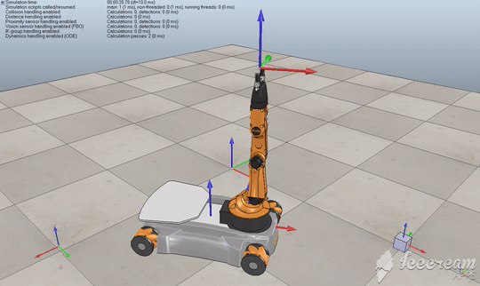

# Capstone-Project-Mobile-Manipulation
* This repo is for the Capstone project from the [Mordern Robotics: Mechanics, Planning, and Control Specialization](https://www.coursera.org/specializations/modernrobotics) on Coursera.
* The goal is to [move and plan]() the trajectory for the end-effector on a 5R robot arm articulated on a four mecanum wheels mobile base to move a cube from one to another specific location.
* Details of the capstone project can be found [here](http://hades.mech.northwestern.edu/index.php/Mobile_Manipulation_Capstone)


# Project Directory:
The project directory should be similar to:
```
├── mr                         # contains library files required to run program
│   ├── ...
|── constants                  # stores the preset values for operating                   
│   ├── PresetValues.m
│   ├── ...
├── helper                     
│   ├── ChassisChange.m        # helper function used to find the new base location
│   ├── Controller.m           # simulates the PI controller   
│   ├── ForwardKinematics.m    # calculates the current component location
│   ├── Hmatrix.m              # used to calculate required twist
│   ├── JointLimitCheck.m      # limits joint motion
│   ├── NextState.m            # finds the joint and wheel velocities
│   ├── T_Generation.m         # constructs the rotation and location vectors 
│   ├── TestLimit.m            # limits joint angles
│   ├── Test_Delta.m           # calculates the motion duration for each segment
│   ├── Traj_conv.m            # converts trajectories to 1x13 array
│   ├── TrajectoryGenerator.m  # generates the end effector motion
├── result
│   ├── Best                   # best result for the capstone task
│   ├── ...
│   ├── NewTask                # best result for a user defined task
│   ├── ...
│   ├── Overshoot              # result with system overshoot
│   ├── ...
│   ├── StartPoint             # first attempt results
│   ├── ...
├── Readme.md
├── main.mlx
```

# How To Use:
1. The code works with an '\mr' folder that can be [downloaded](https://github.com/NxRLab/ModernRobotics) and should be put in the root folder as shown above. The folder should be added to the path.
2. The heavily commented 'main.mlx' generates:
	* A file used to simulate the robot motion in *CoppeliaSim* called 'Path.csv'
	* An 'Xerr.csv' file that documents the end effector error at given instances.
3. Upon execution, the *user* can either select preset values, or have acess to change the following paramenters:
	* Controller gain: Proportional [Kp], Integral [Ki]
	* Chassis parameters: Chasis start configuration, Initial and Final cube locations
	* Gripper parameters:
		* Initial gripper state 1-closed, 0-open
		* Number of trajectories per second [k]
		* Motion type 1 = Screw motion, 2 = Cartesian 
		* Time scaling 3 = Cubic, 5 = Quintic
	* Other parameters include:
		* Maximum wheel speed
		* Maximum joint speed
		* dt-time step
		* Total simulation time

# Results:
The best way I found in manipulating the controller gain is to slowly increase the Proportional gain [Kp] till the system shows signs of over shoot. As shown below:



Then reduce the proportional gain by halfand slowly increase the Integral gain until a settled motion is reached:


# Additional:
The code used is heavily commented and should be easy to follow through. If there's any confusion or suggested improvements, my email is olumidegodson12@gmail.com

